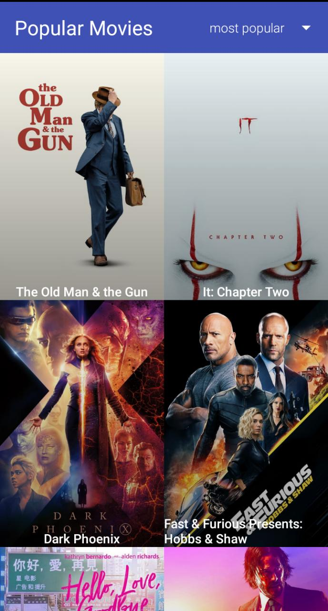
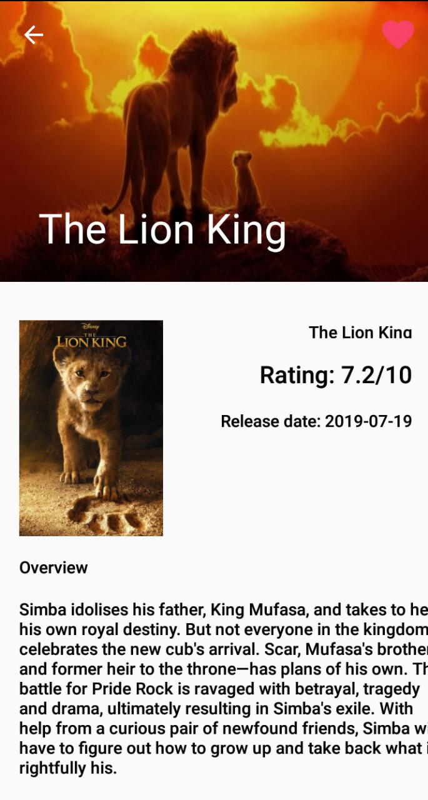
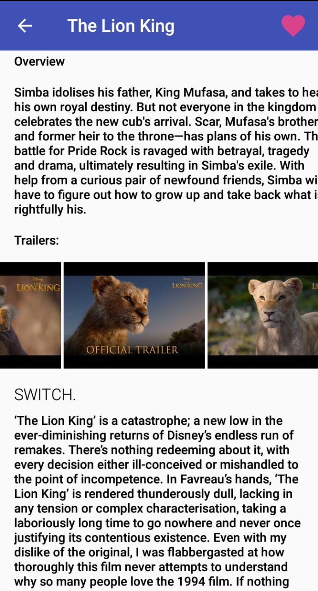

# Popular-Movies

A simple app for discovering the _most-popular_ movies playing. It’s part of the Udacity Android Developer Nanodegree.

## Project Purpose
Bring particular mobile experiences to life by building clean and compelling user interfaces (UIs), fetch data from network services and optimize the experience for various mobile devices. This project demonstrates my understanding of the foundational elements of programming for Android.

## What was learned
* Fetching data from the internet using theMovieDB API.
* Use of adapters and custom list layouts to populate list views.
* Incorporating of libraries to simplify the amount of code needed to be written.

## Features
*	Discover the most popular and highest rated movies.
*	Mark movies as favorite
*	Read through reviews
*	Built using Material Design principles
*	Offline capable
*	UI optimized for phone and tablet

### Preview:
    

